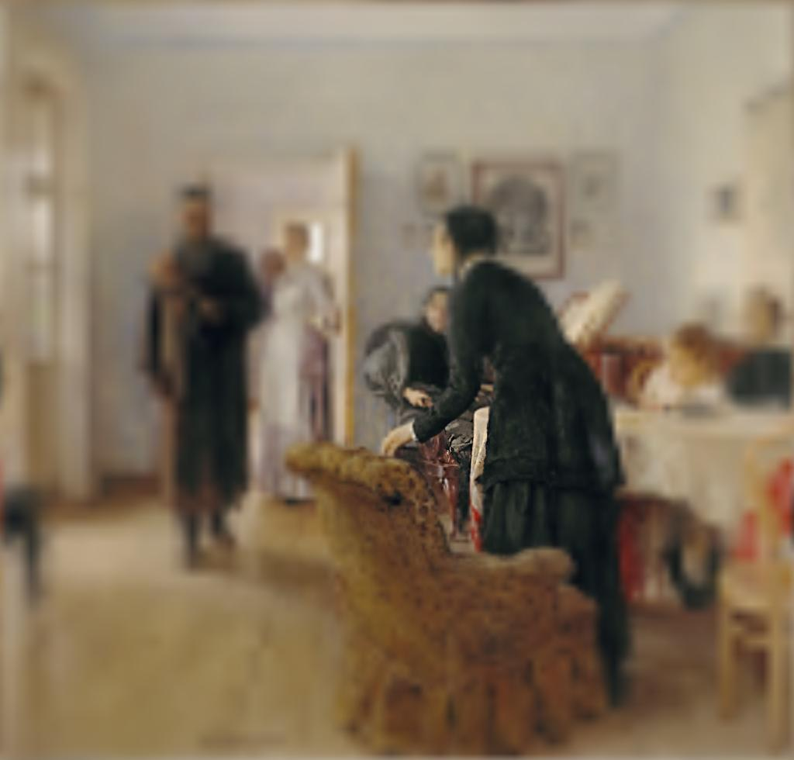
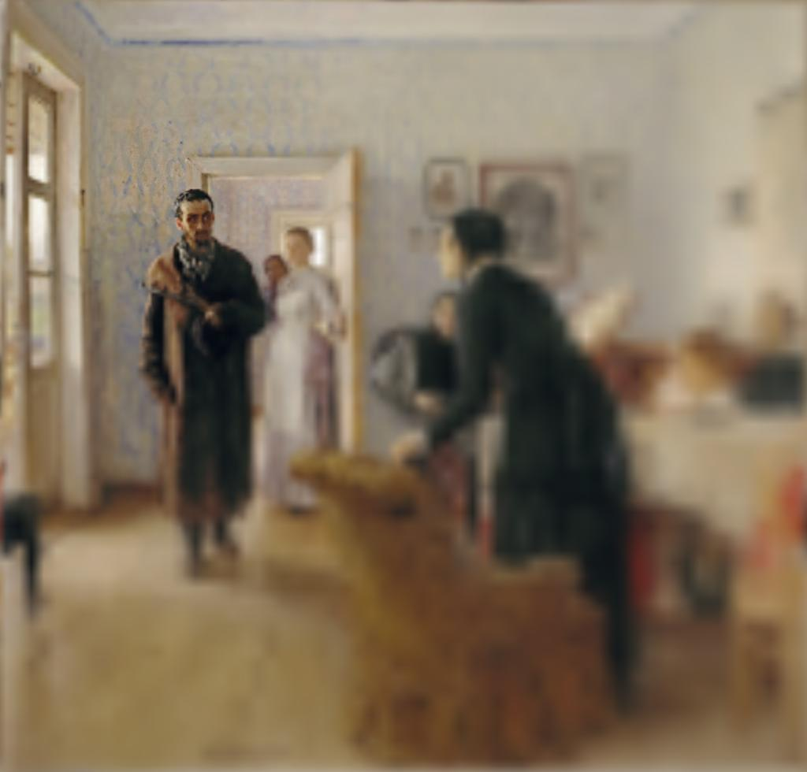

# Foveate_OGL
Implementation of foveation transform for static images in Python and PyOpenGL
The basis for this code is the (BlurredMipmapDemo from Psychtoolbox-3)[https://github.com/Psychtoolbox-3/Psychtoolbox-3/blob/master/Psychtoolbox/PsychDemos/BlurredMipmapDemo.m].

Both gaze position and gaze radius (simulation of the fovea where the image resolution is the highest) can be adjusted as shown in the examples below.

<div>
    
    # Default settings
    
</div>

## Install

This code uses OpenGL 3.3 and GLSL 3.30, make sure your video card supports these and proper drivers are installed.

Install requirements using pip3, these include numpy, glfw, PyOpenGL and Pillow.
```
pip3 install -r requirements.txt
```

## Run

To run a demo:
```
python3 src/foveate_ogl.py -v
```

This will compute foveation transform (with gaze position fixed in the center of the image and foveation radius of 25) over the images in the ```images``` directory and display them in a window.
