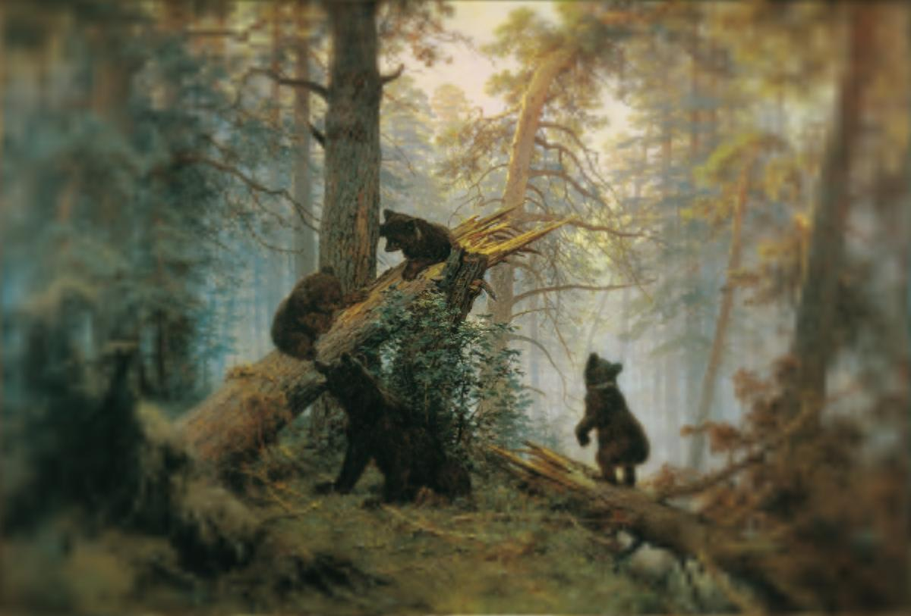

## Foveate OGL
Implementation of foveation transform for static images in Python and PyOpenGL
The basis for this code is the [BlurredMipmapDemo from Psychtoolbox-3](https://github.com/Psychtoolbox-3/Psychtoolbox-3/blob/master/Psychtoolbox/PsychDemos/BlurredMipmapDemo.m).

Both gaze position and gaze radius (simulation of the fovea where the image resolution is the highest) can be adjusted as shown in the examples below. The left image is foveated with default settings (gaze at the center of the image, gaze radius of 25). The right image is foveated with custom settings (gaze location set to (200,200) and gaze radius of 35).

<div>
    
    
</div>


## Foveate OGL Geisler&Perry
Implementation of foveation transform described in [WS Geisler & JS Perry, "Real-time foveated multiresolution system for low-bandwidth video communication", Human vision and electronic imaging III, 1998](https://www.spiedigitallibrary.org/proceedings/Download?fullDOI=10.1117/12.320120).

Gaze position, size and distance to stimuli can be changed via parameters to simulate particular experimental conditions as shown in the examples below. The left image is foveated with default settings (gaze at the center of the image, distance 0.6m, resolution 32 pix2deg). The right image is foveated with custom settings (distance of 2m, resolution of 100 pix2deg).

<div>
    
    
</div>

## Install

This code uses OpenGL 3.3 and GLSL 3.30, make sure your video card supports these and proper drivers are installed.

Install requirements using pip3, these include numpy, glfw, PyOpenGL and Pillow.
```
pip3 install -r requirements.txt
```

## Run

To run a foveate_ogl demo:
```
python3 src/foveate_ogl.py -v
```

This will compute foveation transform (with gaze position fixed in the center of the image and foveation radius of 25) over the images in the ```images``` directory and display them in a window.


To run a demo of Geisler&Perry foveation:
```
python3 src/foveate_gp_ogl.py -v
```

This will compute foveation transform (with gaze position fixed in the center of the image, distance of 0.6 m to the stimuli and 32 pixels per degree of vis angle) over the images in the ```images``` directory and display them in a window.


To see all available options run:
```
python3 src/foveate_ogl.py --help
```

or:

```
python3 src/foveate_gp_ogl.py --help
```

The available options include:
1. ```-i, --inputDir``` - input directory with images (not processed recursively)
2. ```-p, --gazePosition``` - set coordinates of the gaze in the image (e.g. --gazePosition 512,512)
3. ```-r, --gazeRadius``` - set radius of the fovea (the area with the highest resolution)
4. ```-d, --viewDist``` - viewing distance in meters
5. ```-x, --pix2deg``` - number of pixels in 1 degree of visual angle
4. ```-v, --visualize``` - show foveated images
5. ```-o, --outputDir``` - output directory (will be created if doesn't exist)


Should you have any questions about using this code, feel free to raise an issue or email me (yulia_k at eecs.yorku.ca).

